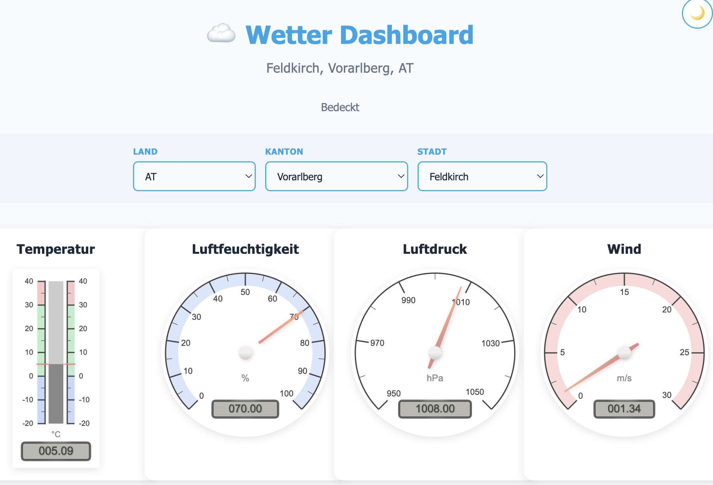

# Wetter Dashboard

Ein interaktives Wetter-Dashboard, das Wetterdaten aus einer MySQL-Datenbank visualisiert. Die Anwendung wurde mit Flask (Python) entwickelt und nutzt Canvas-Gauges für die grafische Darstellung.


*Ansicht des Dashboards im Light Mode.*

## Funktionen

- **Echtzeit-Visualisierung**: Anzeige von Temperatur, Luftfeuchtigkeit, Luftdruck und Windgeschwindigkeit mittels analoger Instrumente (Gauges).
- **Standortwahl**: Dynamische Auswahl von Land, Kanton und Stadt basierend auf verfügbaren Datenbankeinträgen.
- **Dark/Light Mode**: Umschaltbares Design für optimale Lesbarkeit in verschiedenen Umgebungen.
- **Responsive Design**: Passt sich verschiedenen Bildschirmgrößen an.

## Voraussetzungen

- Python 3.x
- MySQL Datenbank
- Internetverbindung (für CDN-Ressourcen wie `canvas-gauges`)

## Installation

1. **Repository klonen**
   ```bash
   git clone <repository-url>
   cd WetterAnzeige
   ```

2. **Abhängigkeiten installieren**
   Es wird empfohlen, ein virtuelles Environment zu nutzen.
   ```bash
   pip install flask mysql-connector-python python-dotenv
   ```

3. **Konfiguration**
   Erstelle eine `.env` Datei im Hauptverzeichnis (oder kopiere `env.example`) und passe die Datenbankverbindung an:
   ```env
   DB_HOST=localhost
   DB_PORT=3306
   DB_USER=dein_db_user
   DB_PASSWORD=dein_db_passwort
   DB_NAME=deine_db_name
   ```

4. **Datenbank**
   Stelle sicher, dass deine MySQL-Datenbank die Tabelle `weather_data` enthält mit Spalten für `country`, `canton`, `city`, `dt` (Timestamp), `temperature`, `humidity`, `pressure`, `wind_speed` und `weather_main`.

## Starten der Anwendung

Starte den Flask-Server:

```bash
python app.py
```

Die Anwendung ist nun unter `http://localhost:5050` erreichbar.

## Docker

Alternativ kannst du die Anwendung auch mit Docker starten.

1. **Image bauen und starten**
   ```bash
   docker-compose up -d --build
   ```

2. **Container stoppen**
   ```bash
   docker-compose down
   ```

## Projektstruktur

- `app.py`: Hauptanwendung (Backend), API-Endpunkte.
- `templates/index.html`: Frontend mit HTML/JS und Gauge-Logik.
- `static/`: Statische Dateien (Bilder, CSS, etc.).
- `get_cantons.py`: Hilfsskript zum Abfragen verfügbarer Kantone/Länder.
